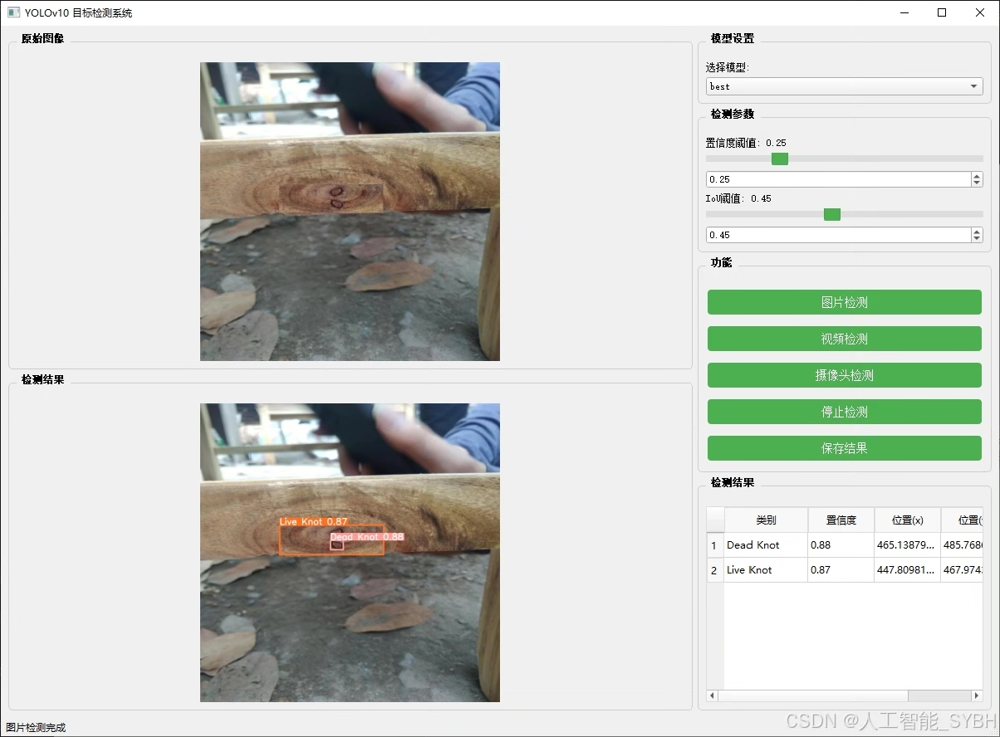
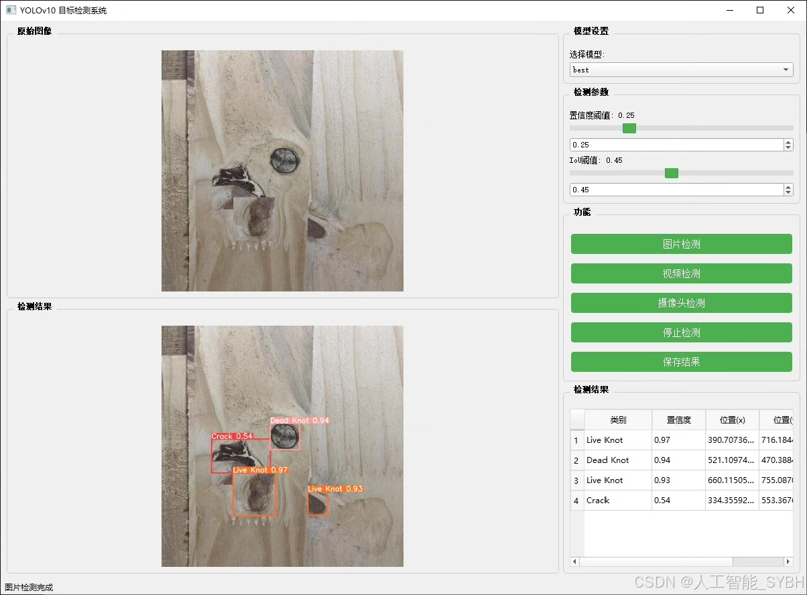
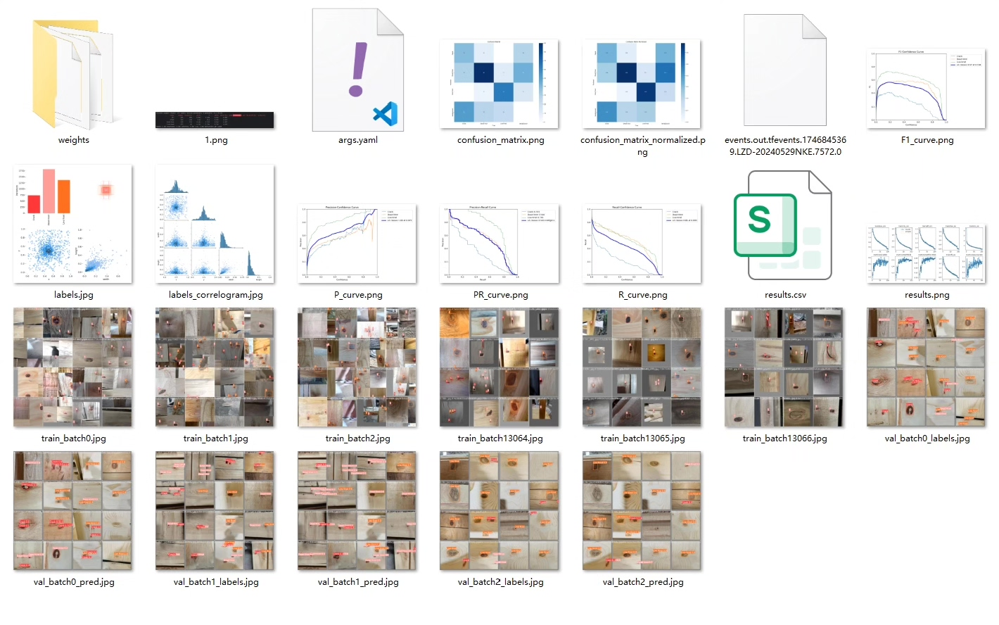
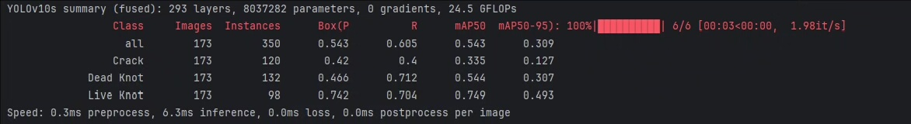
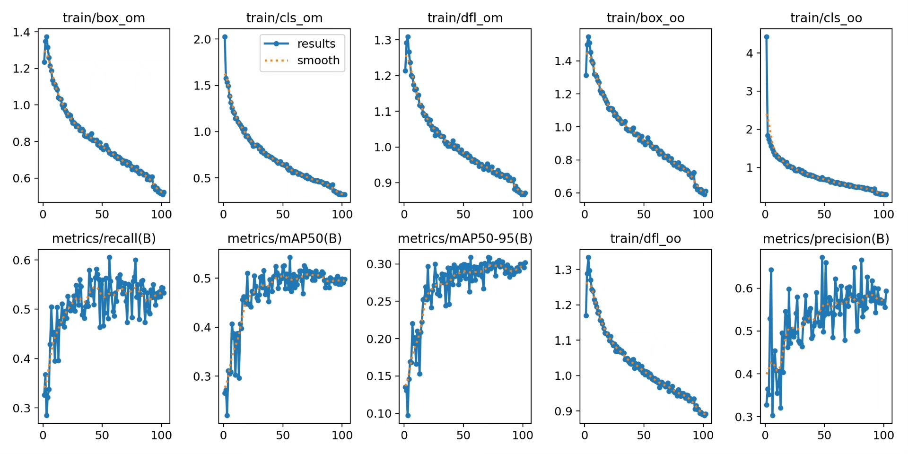
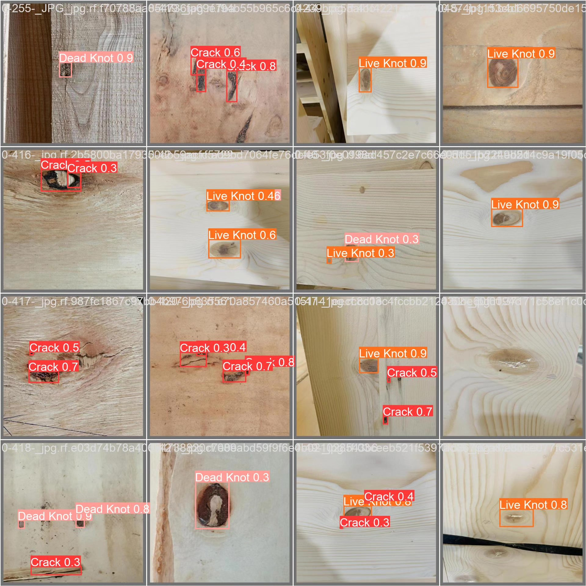
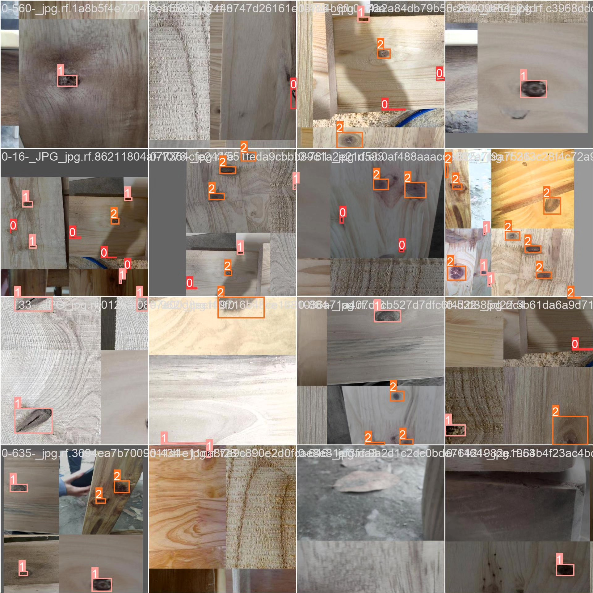
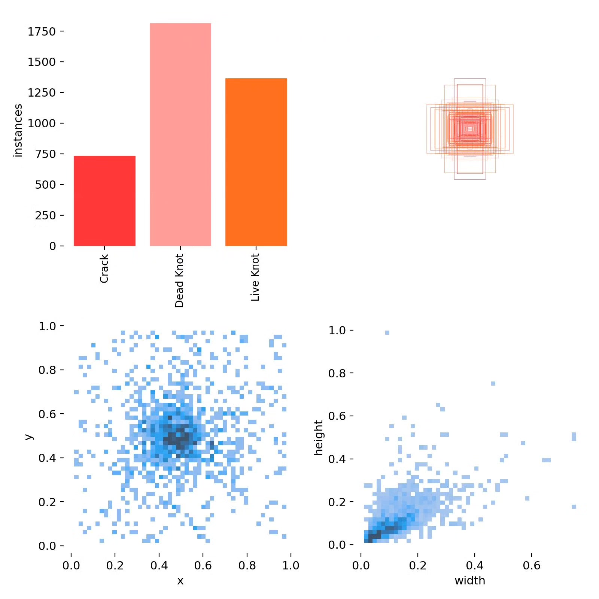

# Wood defect detection system based on deep learning YOLOv10

## Body

Based on the YOLOv10 algorithm, this project has developed a highly efficient and accurate wood defect detection system. It is specifically designed to identify and classify three common defects on the surface of wood: cracks (Crack), dead knots (Dead Knot), and live knots (Live Knot). The system can quickly locate the location of defects in real-time through image analysis of wood surface images, and determine their types, providing an automated solution for wood quality assessment and grading. The project uses a dataset containing 2606 labeled images for training and validation, with 2259 training images, 173 validation images, and 174 test images. Experimental results show that the system achieves high accuracy and recall rates in the wood defect detection task, meeting the needs of industrial production for wood quality inspection.

The company's products have obtained the official commercial license certification from YOLO.

We provide after-sales service.

After payment, we will provide WeChat ID for any questions.

Environment configuration: We will provide a tutorial on environment configuration, and WeChat will provide answers to questions.

Remote installation service: If you need remote configuration, an additional fee of 69 is required.
If the configuration fails, all fees will be refunded (specially for old computers only refund installation fees)

Retraining dataset: After configuring the environment, you can train on your own computer.
If you need us to retrain, just pay 69 + computing power fees (2.5 yuan/hour)

## Images

## Payment

Here is a pay link on Stripe ( https://buy.stripe.com/3cs8yP7sY87d0vu9AB ). Please contact me lonlonago@foxmail.com after funding $89, and I will send you a complete data files , thank you!

